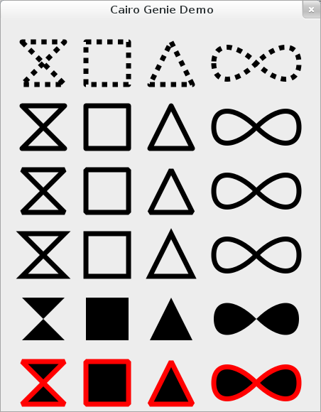

# Genie Cairo sample

Two examples from the archived GNOME Wiki page
[Projects/Genie/CairoSample](https://wiki.gnome.org/Projects/Genie/CairoSample):
a GTK **3** window that draws Cairo paths, and a **GTK+ 2** shaped transparent
“clock” window (legacy APIs: `expose_event`, `Gdk.Pixmap`, `input_shape_combine_mask`, and so on).

::: danger GTK+ 2 second example
The shaped clock targets **GTK+ 2** and old GDK integration. It is preserved
here as documentation; porting it to GTK 3 or 4 requires substantial rewrites
(draw callbacks, input shape, rgba visuals).
:::

## Drawing primitives (GTK+ 3)

Running `cairosample.gs` opens a window titled **Cairo Genie Demo** with rows
of stroked and filled paths (bowtie, square, triangle, and lemniscate-like
shape), illustrating dashes, line joins, stroke, fill, and a red outline on the
last row:



Save as `cairosample.gs`.

```genie
uses
	Gtk
	Cairo

class CairoSample : Gtk.Window

	const private SIZE : int = 30

	construct ()
		self.title = "Cairo Genie Demo"
		self.destroy.connect (Gtk.main_quit)
		set_default_size (450, 550)
		create_widgets ()

	def private create_widgets ()
		var drawing_area = new DrawingArea ()
		drawing_area.draw.connect (on_draw)
		add (drawing_area)

	def private on_draw (da : Widget, ctx : Context) : bool
		ctx.set_source_rgb (0, 0, 0)

		ctx.set_line_width (SIZE / 4)
		ctx.set_tolerance (0.1)

		ctx.set_line_join (LineJoin.ROUND)
		dbl_arr : array of double = {SIZE / 4.0, SIZE / 4.0}
		ctx.set_dash (dbl_arr, 0)
		stroke_shapes (ctx, 0, 0)

		ctx.set_dash (null, 0)
		stroke_shapes (ctx, 0, 3 * SIZE)

		ctx.set_line_join (LineJoin.BEVEL)
		stroke_shapes (ctx, 0, 6 * SIZE)

		ctx.set_line_join (LineJoin.MITER)
		stroke_shapes (ctx, 0, 9 * SIZE)

		fill_shapes (ctx, 0, 12 * SIZE)

		ctx.set_line_join (LineJoin.BEVEL)
		fill_shapes (ctx, 0, 15 * SIZE)
		ctx.set_source_rgb (1, 0, 0)
		stroke_shapes (ctx, 0, 15 * SIZE)

		return true

	def private stroke_shapes (ctx : Context, x : int, y : int)
		self.draw_shapes (ctx, x, y, ctx.stroke)

	def private fill_shapes (ctx : Context, x : int, y : int)
		self.draw_shapes (ctx, x, y, ctx.fill)

	delegate private DrawMethod ()

	def private draw_shapes (ctx : Context, x : int, y : int, draw_method : DrawMethod)
		ctx.save ()

		ctx.new_path ()
		ctx.translate (x + SIZE, y + SIZE)
		bowtie (ctx)
		draw_method ()

		ctx.new_path ()
		ctx.translate (3 * SIZE, 0)
		square (ctx)
		draw_method ()

		ctx.new_path ()
		ctx.translate (3 * SIZE, 0)
		triangle (ctx)
		draw_method ()

		ctx.new_path ()
		ctx.translate (3 * SIZE, 0)
		inf (ctx)
		draw_method ()

		ctx.restore ()

	def private triangle (ctx : Context)
		ctx.move_to (SIZE, 0)
		ctx.rel_line_to (SIZE, 2 * SIZE)
		ctx.rel_line_to (-2 * SIZE, 0)
		ctx.close_path ()

	def private square (ctx : Context)
		ctx.move_to (0, 0)
		ctx.rel_line_to (2 * SIZE, 0)
		ctx.rel_line_to (0, 2 * SIZE)
		ctx.rel_line_to (-2 * SIZE, 0)
		ctx.close_path ()

	def private bowtie (ctx : Context)
		ctx.move_to (0, 0)
		ctx.rel_line_to (2 * SIZE, 2 * SIZE)
		ctx.rel_line_to (-2 * SIZE, 0)
		ctx.rel_line_to (2 * SIZE, -2 * SIZE)
		ctx.close_path ()

	def private inf (ctx : Context)
		ctx.move_to (0, SIZE)
		ctx.rel_curve_to (0, SIZE, SIZE, SIZE, 2 * SIZE, 0)
		ctx.rel_curve_to (SIZE, -SIZE, 2 * SIZE, -SIZE, 2 * SIZE, 0)
		ctx.rel_curve_to (0, SIZE, -SIZE, SIZE, -2 * SIZE, 0)
		ctx.rel_curve_to (-SIZE, -SIZE, -2 * SIZE, -SIZE, -2 * SIZE, 0)
		ctx.close_path ()

init
	Gtk.init (ref args)

	var cairo_sample = new CairoSample ()
	cairo_sample.show_all ()

	Gtk.main ()
```

### Compile and run

```shell
valac --pkg gtk+-3.0 cairosample.gs
./cairosample
```

## Shaped window (GTK+ 2)

Save as `cairo-shaped.gs`. Requires GTK+ 2, GDK 2, and Cairo.

```genie
uses
	Gtk
	Cairo
	Gdk

// Shaped, transparent clock window (GTK+ 2). Legacy GTK+ 2 / GDK APIs.
class CairoShaped : Gtk.Window

	inside : bool = false

	construct ()
		self.title = "Cairo Vala Demo"
		set_default_size (200, 200)

		this.skip_taskbar_hint = true

		this.decorated = false
		this.app_paintable = true

		set_colormap (this.screen.get_rgba_colormap ())

		add_events (Gdk.EventMask.BUTTON_PRESS_MASK)
		add_events (Gdk.EventMask.ENTER_NOTIFY_MASK)
		add_events (Gdk.EventMask.LEAVE_NOTIFY_MASK)

		self.enter_notify_event.connect (enter_event)
		self.leave_notify_event.connect (leave_event)
		self.button_press_event.connect (handle_btn_press)

		this.expose_event.connect (on_expose)

		this.destroy.connect (Gtk.main_quit)

	def handle_btn_press (e : Gdk.EventButton) : bool
		begin_move_drag ((int) e.button, (int) e.x_root, (int) e.y_root, e.time)
		return true

	def leave_event () : bool
		self.inside = false
		self.queue_draw ()
		return true

	def enter_event () : bool
		self.inside = true
		self.queue_draw ()
		return true

	def private on_expose (da : Widget, event : Gdk.EventExpose) : bool
		var ctx = Gdk.cairo_create (da.window)

		ctx.set_source_rgba (1.0, 1.0, 1.0, 0.0)

		ctx.set_operator (Cairo.Operator.SOURCE)
		ctx.paint ()

		radius : float = 100

		var p = new Cairo.Pattern.radial (100, 100, 0, 100, 100, 100)
		if inside
			p.add_color_stop_rgba (0.0, c (10), c (190), c (10), 1.0)
			p.add_color_stop_rgba (0.8, c (10), c (190), c (10), 0.7)
			p.add_color_stop_rgba (1.0, c (10), c (190), c (10), 0.5)
		else
			p.add_color_stop_rgba (0.0, c (10), c (10), c (190), 1.0)
			p.add_color_stop_rgba (0.8, c (10), c (10), c (190), 0.7)
			p.add_color_stop_rgba (1.0, c (10), c (10), c (190), 0.5)

		ctx.set_source (p)
		ctx.arc (100, 100, radius, 0, 2.0 * 3.14)
		ctx.fill ()
		ctx.stroke ()

		if inside
			ctx.set_source_rgba (0.0, 0.2, 0.6, 0.8)
		else
			ctx.set_source_rgba (c (226), c (119), c (214), 0.8)

		for var i = 0 to 12
			ctx.arc (100 + 90.0 * Math.cos (2.0 * 3.14 * (i / 12.0)),
				100 + 90.0 * Math.sin (2.0 * 3.14 * (i / 12.0)),
				5, 0, 2.0 * 3.14)
			ctx.fill ()
			ctx.stroke ()

		ctx.move_to (100, 100)
		ctx.set_source_rgba (0, 0, 0, 0.8)

		var t = Time.local (time_t ())
		hour : int = t.hour
		minutes : int = t.minute
		seconds : int = t.second
		per_hour : double = (2 * 3.14) / 12
		dh : double = (hour * per_hour) + ((per_hour / 60) * minutes)
		dh += 2 * 3.14 / 4
		ctx.set_line_width (0.05 * radius)
		ctx.rel_line_to (-0.5 * radius * Math.cos (dh), -0.5 * radius * Math.sin (dh))
		ctx.move_to (100, 100)
		per_minute : double = (2 * 3.14) / 60
		dm : double = minutes * per_minute
		dm += 2 * 3.14 / 4
		ctx.rel_line_to (-0.9 * radius * Math.cos (dm), -0.9 * radius * Math.sin (dm))
		ctx.move_to (100, 100)
		per_second : double = (2 * 3.14) / 60
		ds : double = seconds * per_second
		ds += 2 * 3.14 / 4
		ctx.rel_line_to (-0.9 * radius * Math.cos (ds), -0.9 * radius * Math.sin (ds))
		ctx.stroke ()

		ctx.set_source_rgba (c (124), c (32), c (113), 0.7)

		ctx.arc (100, 100, 0.1 * radius, 0, 2.0 * 3.14)
		ctx.fill ()
		ctx.stroke ()

		var px = new Gdk.Pixmap (null, 200, 200, 1)
		var pmcr = Gdk.cairo_create (px)

		pmcr.set_source_rgba (1.0, 1.0, 1.0, 0.0)
		pmcr.set_operator (Cairo.Operator.SOURCE)
		pmcr.paint ()

		pmcr.set_source_rgba (0, 0, 0, 1)

		pmcr.arc (100, 100, 10, 0, 2.0 * 3.14)
		pmcr.fill ()
		pmcr.stroke ()
		for var i = 0 to 12
			pmcr.arc (100 + 90.0 * Math.cos (2.0 * 3.14 * (i / 12.0)),
				100 + 90.0 * Math.sin (2.0 * 3.14 * (i / 12.0)),
				5, 0, 2.0 * 3.14)
			pmcr.fill ()
			pmcr.stroke ()

		input_shape_combine_mask ((Gdk.Bitmap*) px, 0, 0)
		return true

	def private c (val : int) : double
		return val / 255.0

	def updatedraw () : bool
		self.queue_draw ()
		return true

init
	Gtk.init (ref args)

	var cairo_sample = new CairoShaped ()
	cairo_sample.show_all ()

	Timeout.add_seconds (1, cairo_sample.updatedraw)

	Gtk.main ()
```

### Compile and run

```shell
valac --pkg gtk+-2.0 --pkg cairo --pkg gdk-2.0 cairo-shaped.gs
./cairo-shaped
```
